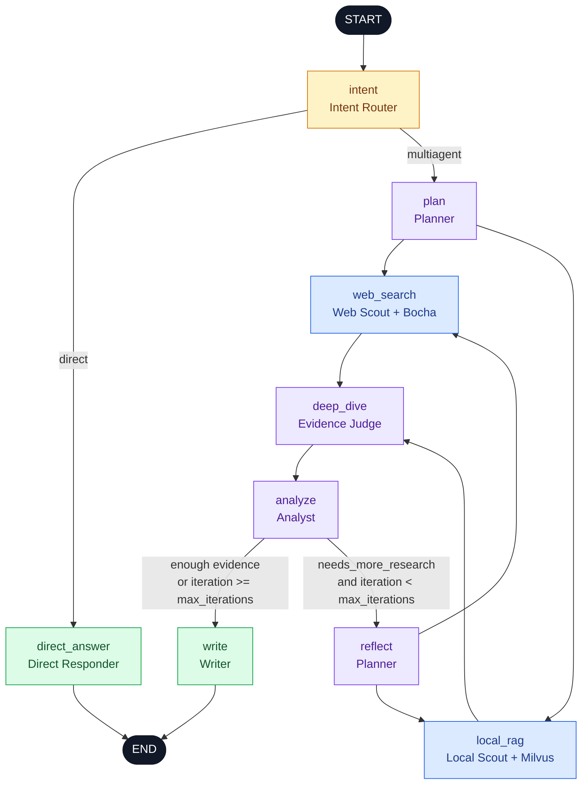

# LangGraph Architecture

This document describes the LangGraph workflow implemented by ResearchMind. The source of truth is [`app/mult_agents/graph.py`](../app/mult_agents/graph.py), with node behavior in [`app/mult_agents/nodes.py`](../app/mult_agents/nodes.py) and shared state in [`app/mult_agents/state.py`](../app/mult_agents/state.py).

## Workflow diagram

## Routing behavior

The graph starts by classifying the request:

- `direct` sends a simple question to `direct_answer`, which produces the final response and exits.
- `multiagent` sends a research request through planning, retrieval, evidence auditing, analysis, optional reflection, and report writing.

The deep-research route uses a fan-out/fan-in pattern:

1. `plan` creates the outline, sub-questions, research questions, search plan, and budget.
2. `web_search` and `local_rag` run as parallel branches.
3. Both branches join at `deep_dive`, which scores, deduplicates, and audits the combined evidence.
4. `analyze` creates findings and a claim map, then decides whether evidence gaps remain.
5. If more research is required and the iteration limit has not been reached, `reflect` creates supplementary queries and starts another parallel retrieval round.
6. Otherwise, `write` creates the final Markdown report, validates citation IDs, appends the reference section, and exits.

`iteration` starts at `0` and is incremented by `reflect`. Therefore, `max_iterations` limits supplementary research rounds after the initial retrieval round.

## Node responsibilities

| Graph node | Bound agent | Main responsibility | Important state output |
| --- | --- | --- | --- |
| `intent` | `intent_router` | Combines rule-based intent detection with an LLM classification. | `intent` |
| `direct_answer` | `direct_responder` | Answers simple requests without running the research pipeline. | `final`, `draft` |
| `plan` | `planner` | Decomposes the query and derives a structured search plan. | `outline`, `sub_questions`, `search_plan`, `budget` |
| `web_search` | `scout_web` | Queries Bocha, filters and deduplicates results, and structures web evidence. | `web_evidence`, `web_retrieval_stats`, `web_search_trace` |
| `local_rag` | `scout_local` | Searches the Milvus-backed local knowledge base and structures local evidence. | `local_evidence`, `local_retrieval_stats`, `local_rag_trace` |
| `deep_dive` | `evidence_judge` | Merges both retrieval paths, scores reliability, detects audit flags, and builds the source index. | `evidence_pool`, `audit_flags`, `source_index` |
| `analyze` | `analyst` | Produces findings and claim-to-source mappings, and detects missing evidence. | `findings`, `claim_map`, `needs_more_research`, `missing_gaps` |
| `reflect` | `planner` | Turns evidence gaps into supplementary web/local queries. | `supplementary_queries`, `iteration` |
| `write` | `writer` | Writes the final report and validates citations against `source_index`. | `final`, `draft` |

## Shared state

`ResearchState` is the graph-wide contract. Its fields fall into six groups:

| State group | Representative fields |
| --- | --- |
| Request and identity | `query`, `user_id`, `tenant_id`, `memory_context` |
| Conversation history | `messages` |
| Planning | `outline`, `sub_questions`, `research_questions`, `search_plan`, `budget` |
| Retrieval and audit | `web_evidence`, `local_evidence`, `evidence_pool`, `audit_flags`, `source_index` |
| Analysis and control | `findings`, `claim_map`, `needs_more_research`, `missing_gaps`, `iteration`, `max_iterations` |
| Output | `draft`, `final` |

`messages` uses an additive reducer (`operator.add`), allowing parallel node updates to be merged by LangGraph. The other fields are replaced by the node that owns them; retrieval nodes explicitly append new evidence to evidence already stored in state.

## Runtime and persistence

The CLI and FastAPI service both construct the same compiled graph:

1. Build the eight specialized LLM agents.
2. Initialize optional Milvus retrieval and personalized memory.
3. Select a LangGraph checkpointer: PostgreSQL, Redis, or in-memory fallback.
4. Create the initial `ResearchState`.
5. Invoke or stream the compiled graph with `thread_id` as the checkpoint key.
6. Persist the completed user/assistant turn through `MemoryManager` when memory is enabled.

This separates checkpointing from long-term memory:

- The checkpointer persists graph execution state and supports thread continuity.
- `MemoryManager` retrieves personalized context before execution and stores completed turns afterward.

## Architecture assessment

### Strengths

- The direct route avoids the cost and latency of deep research for simple questions.
- Parallel web and local retrieval provide complementary evidence while keeping the graph readable.
- The reflection loop is bounded, preventing uncontrolled research cycles.
- Evidence IDs are carried into a source index and validated before the final report, improving citation traceability.
- The same graph supports synchronous CLI calls and streamed API progress events.

### Current risks and improvement opportunities

- `direct_answer_node` returns `analysis_summary`, but that key is not declared in `ResearchState`. Add it to the state schema or remove the update to keep the state contract explicit.
- `messages` grows on every node and reflection round because it uses an additive reducer. Even though most node invocations intentionally avoid replaying the full history, checkpoint size can still grow over time.
- Retrieval failures are handled inside nodes, but the graph has no explicit retry, timeout, or error-routing nodes. A transient provider failure can still stop the workflow.
- When both retrieval branches return no evidence, `deep_dive` returns an empty update and the graph still advances to analysis and writing. An explicit no-evidence route could produce a clearer user-facing result.
- The default `max_iterations` represents supplementary rounds, not total retrieval rounds. Naming it `max_reflection_rounds` would make the behavior easier to understand.

## Source map

| Concern | File |
| --- | --- |
| Graph nodes, edges, and conditional routing | [`app/mult_agents/graph.py`](../app/mult_agents/graph.py) |
| Node implementations and citation validation | [`app/mult_agents/nodes.py`](../app/mult_agents/nodes.py) |
| Shared state schema and initialization | [`app/mult_agents/state.py`](../app/mult_agents/state.py) |
| Agent construction and checkpointer selection | [`app/mult_agents/main.py`](../app/mult_agents/main.py) |
| Web and local retrieval tools | [`app/mult_agents/tools.py`](../app/mult_agents/tools.py) |
| FastAPI execution and streaming integration | [`app/backend/service/workflow_service.py`](../app/backend/service/workflow_service.py) |
